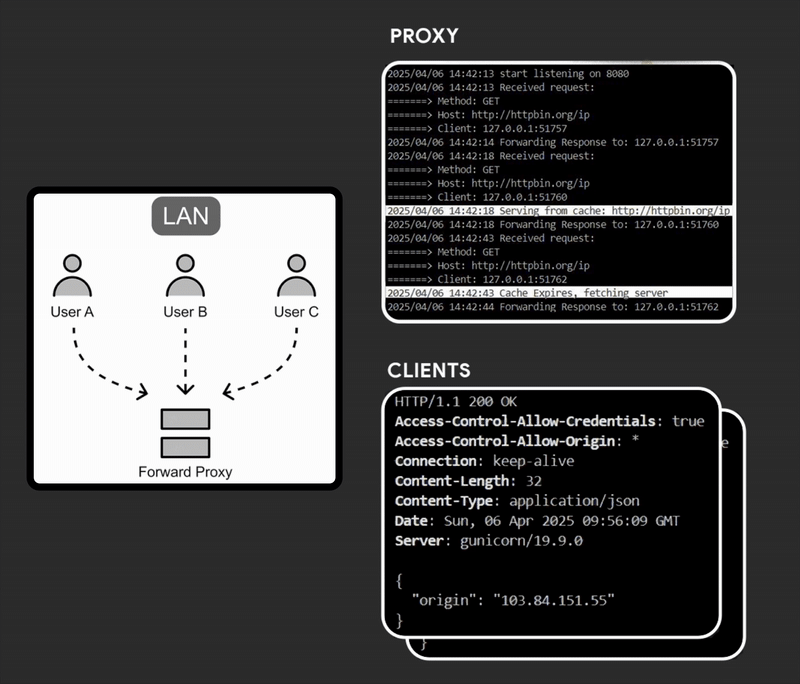

# Forward Proxy


A basic HTTP proxy server with built-in features for request handling and response caching. It includes security features such as a forbidden host firewall and banned words detection.



## Features

- **Standard HTTP Proxy**: Handles and forwards HTTP requests.
- **Forbidden Host Firewall**: Prevents requests to forbidden hosts.
- **Banned Words Detection**: Filters responses based on banned words.
- **Logging**: Logs all incoming requests and activities.
- **Response Caching**: Caches responses to reduce redundant network requests.

## To Be Implemented

- **TLS Support for HTTPS**: Support for secure connections is coming soon.

## How to Run

1. Build the project.
2. Run the proxy server with the command:

   ```bash
   ./main.exe
   ```

This will start the proxy server on your local machine.

---